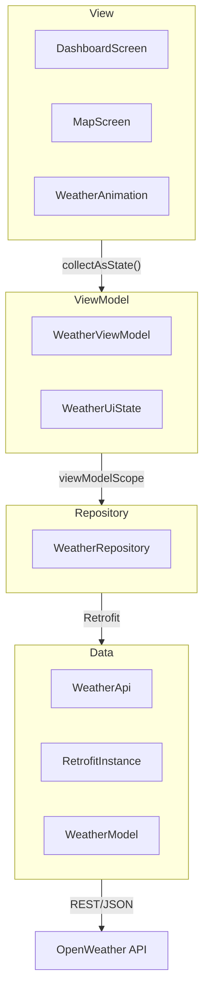

# CityPulse-Android
Real-time weather app for Android built with MVVM architecture.

## Features
- Real-time weather with OpenWeather API
- Google Maps with automatic day/night style
- Rain overlay animations
- City search
- Canvas weather animations (sun, clouds, rain, storm, snow)

## Architecture
MVVM + Repository Pattern

## Tech Stack
| Layer | Technology |
|-------|-----------|
| UI | Jetpack Compose |
| Networking | Retrofit + Gson |
| Maps | Google Maps SDK |
| DI | Hilt |
| Async | Coroutines + StateFlow |
| Image loading | Coil |
| Package Manager | Gradle (KTS) |

## Architecture Diagram
